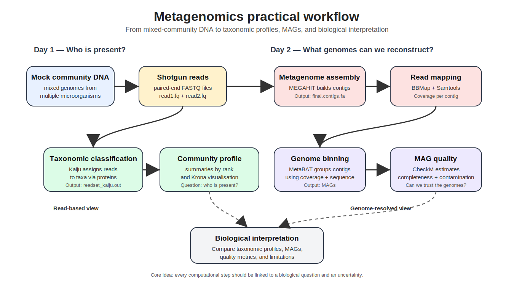

# Metagenomics Practical
## Microbial Genomics Course

> **From millions of sequencing reads to microbial genomes and biological insight**

---

---

## Welcome

Welcome to the **Metagenomics Practical** of the Microbial Genomics course.

In this two-day practical you will analyse a shotgun metagenomics dataset using the same computational workflow employed in modern microbiome research. Starting from raw sequencing reads, you will reconstruct microbial genomes, evaluate their quality, and interpret the biological composition of a microbial community.

Rather than focusing on learning software commands, this practical is organised around a series of biological questions that guide every computational analysis.

---

# Learning goals

By the end of this practical you will be able to

- explain the difference between shotgun metagenomics and amplicon sequencing;
- perform taxonomic classification of metagenomic sequencing reads;
- reconstruct genomes from complex microbial communities;
- assess the quality of metagenome-assembled genomes (MAGs);
- critically interpret metagenomics results and recognise their limitations.

---

# The story

Throughout this practical we answer four biological questions.

| Biological question | Analysis |
|---------------------|----------|
| **Who is present?** | Taxonomic classification |
| **What genomes are present?** | Metagenome assembly |
| **Which contigs belong together?** | Genome binning |
| **Can we trust these genomes?** | MAG quality assessment |

Everything you will do fits somewhere within these four questions.

---

# Course roadmap

## Part I — Foundations

📖 [01 Learning objectives](01-learning-objectives.md)

📖 [02 Shotgun versus amplicon sequencing](02-shotgun-vs-amplicon.md)

📖 [03 The metagenomics workflow](03-metagenomics-workflow.md)

---

## Part II — Practical analysis

🧬 [04 Taxonomic classification](04-taxonomic-classification.md)

🌳 [05 Community visualization](05-community-visualization.md)

🧩 [06 Metagenome assembly](06-metagenome-assembly.md)

📈 [07 Read mapping and coverage](07-read-mapping.md)

🧬 [08 Genome binning](08-genome-binning.md)

✅ [09 MAG quality assessment](09-mag-quality.md)

---

## Part III — Interpretation

💡 [10 Discussion and biological interpretation](10-discussion.md)

---

# Dataset

Throughout the practical we analyse a publicly available **mock microbial community**.

Using a mock community has several advantages:

- the expected organisms are known;
- the quality of different analysis steps can be evaluated;
- results are easier to interpret than highly complex environmental datasets.

The workflow, however, is identical to analyses routinely performed on soil, plant, marine and human microbiomes.

---

# Software used

| Purpose | Software |
|----------|----------|
| Taxonomic classification | Kaiju |
| Community visualisation | Krona |
| Assembly | MEGAHIT |
| Read mapping | BBMap |
| Alignment statistics | Samtools |
| Genome binning | MetaBAT |
| MAG quality | CheckM |

---

# Before you begin

You should already be familiar with

- Linux command line
- FASTA and FASTQ files
- basic bacterial genomics
- sequence alignment
- genome assembly

If these concepts are unfamiliar, review the earlier practicals before continuing.

---

# A recurring theme

Throughout the practical, always ask yourself:

> **What biological question does this analysis answer?**

> **What assumptions does the method make?**

> **How confident am I in the result?**

These questions are considerably more important than remembering individual software commands.

---

# Further reading

- Quince et al. (2017). *Shotgun metagenomics, from sampling to analysis.*
- Bowers et al. (2017). *Minimum Information about a Metagenome-Assembled Genome (MIMAG).*
- Almeida et al. (2021). *A unified catalogue of microbial genomes.*

---

## Ready?

➡️ Continue with **[01 Learning objectives](01-learning-objectives.md)**.
